  

  

  
  
  
  

* * *

##  About Me

- Building scalable distributed systems and cloud-native applications
- Focused on microservices and event-driven architecture (Kafka, SQS/SNS)
- Hands-on with Kubernetes, Docker, and Infrastructure as Code
- Strong security foundation: SAML 2.0, OAuth 2.0, JWT, encryption
- Interested in observability, resiliency, and zero-downtime deployments
- Based in Toronto, ON

* * *

##  Tech Stack

### Languages

### Frameworks & Runtime

### Cloud, DevOps & Data

* * *

##  GitHub Analytics

  
  

  

  

  

* * *

##  Education & Certification

- **M.Sc Applied Computing** - University of Windsor (2020)
- **AWS Certified Developer Associate** - [View Credential](https://www.credly.com/badges/7195af3f-fe69-464b-80df-6697db95a5d7/)

  

